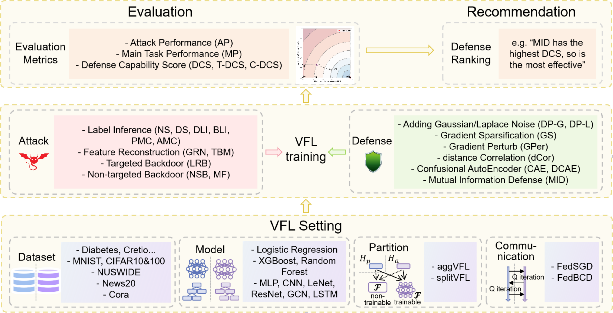
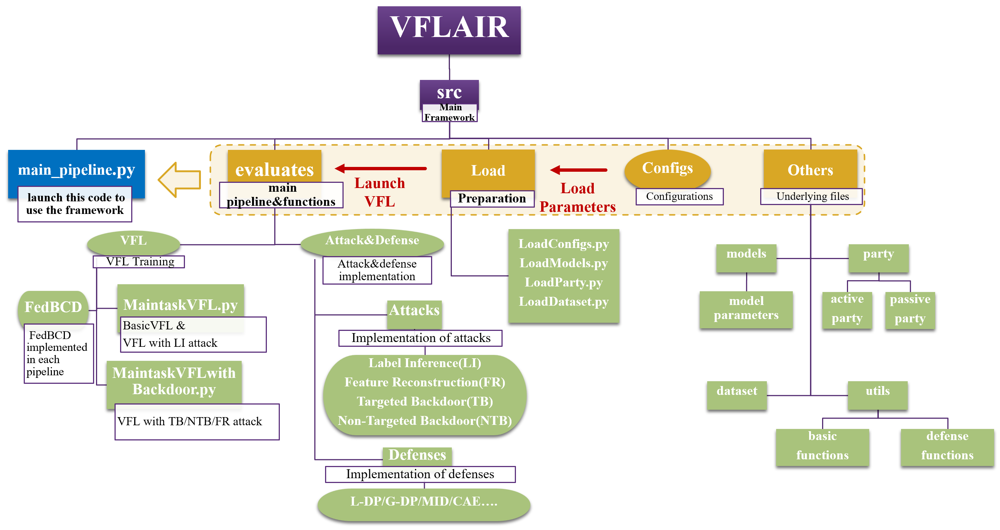

# VFLAIR
 
## Basic Introduction

  VFLAIR is a general, extensible and light-weight VFL framework that provides vanilar VFL training and evaluation process simulation alonging with several effective communication improvement methods as well as attack and defense evaluations considering data safety and privacy. Aside from NN serving as local models for VFL systems, tree-based VFL is also supported.

  * VFLAIR provides simulation of the vanilar VFL process containing forward local model prediction transmits, backward gradient transmits as well as local and global model updates.
  * **FedBCD** ([paper](https://ieeexplore.ieee.org/abstract/document/9855231/)) is provided for improving the effectiveness of VFL training process.
  * Four attack types are included in VFLAIR as examples for training-decoupled attack and training-time attack separately. In each attack type, multiple attack is available for use:
      * **Label Inference(LI)** 
          * Batch-level Label Inference ([paper](https://ieeexplore.ieee.org/abstract/document/9833321/))/Direct Label Inference ([paper](https://ieeexplore.ieee.org/abstract/document/9833321/))
          * Norm-based Scoring (NS) ([paper]([[2102.08504\] Label Leakage and Protection in Two-party Split Learning (arxiv.org)](https://arxiv.org/abs/2102.08504)))/Direction-based Scoring (DS) ([paper]([[2102.08504\] Label Leakage and Protection in Two-party Split Learning (arxiv.org)](https://arxiv.org/abs/2102.08504)))
          * Passive Model Completion (PMC) ([paper]([Label Inference Attacks Against Vertical Federated Learning | USENIX](https://www.usenix.org/conference/usenixsecurity22/presentation/fu-chong)))/Active Model Completion (AMC) ([paper]([Label Inference Attacks Against Vertical Federated Learning | USENIX](https://www.usenix.org/conference/usenixsecurity22/presentation/fu-chong)))
      * **Feature Reconstruction(FR)**
          * Generative Regression Network (GRN)([paper]([[2010.10152\] Feature Inference Attack on Model Predictions in Vertical Federated Learning (arxiv.org)](https://arxiv.org/abs/2010.10152)))
          * Training-based Back Mapping by model inversion (TBM)([paper]([[2205.04007v1\] ResSFL: A Resistance Transfer Framework for Defending Model Inversion Attack in Split Federated Learning (arxiv.org)](https://arxiv.org/abs/2205.04007v1)))
      * **Targeted Backdoor(TB)**
          *  Label replacement Backdoor ([paper](https://ieeexplore.ieee.org/abstract/document/9833321/)) 
      * **Non-Targeted Backdoor(NTB)**
          * Noisy-Sample Backdoor (NSB)([paper](https://ieeexplore.ieee.org/abstract/document/9833321/)) 
          * Missing Feature (MF)([paper]([Liu2021.pdf (neurips2021workshopfl.github.io)](https://neurips2021workshopfl.github.io/NFFL-2021/papers/2021/Liu2021.pdf))) 
  * Several basic defense methods as well as emerging defense strategies are provided in VFLAIR and can be flexibly applied in VFL training and testing flow. Defense methods provided in VFLAIR is listed below. Detail information of these defenses are included in `/src/configs/README.md`.
    * **Differentail Privacy (Laplace-DP and Gaussian-DP)** ([paper](https://www.google.com.au/books/edition/Theory_and_Applications_of_Models_of_Com/JHFqCQAAQBAJ?hl=en&gbpv=1&pg=PA1&printsec=frontcover))
    * **Gradient Sparsification (GS)** ([paper](https://openreview.net/forum?id=SkhQHMW0W))
    * **Confusional AutoEncoder (CAE) & DiscreteSGD enhanced CAE（DCAE)** ([paper](https://ieeexplore.ieee.org/abstract/document/9833321/))
    * **Mutual Information regularization Defense(MID)** ([paper](https://arxiv.org/abs/2301.01142))
    * **GradPerturb(GPer)** ([paper]([[2203.02073\] Differentially Private Label Protection in Split Learning (arxiv.org)](https://arxiv.org/abs/2203.02073)))
    * **Distance Correlation(dCor)** ([paper]([[2203.01451\] Label Leakage and Protection from Forward Embedding in Vertical Federated Learning (arxiv.org)](https://arxiv.org/abs/2203.01451)))
  * Multiple datasets are provided along with VFLAIR.
  * Defense Capability Score ——a comprehensive metric for assessing defense ability is also introduced.
  * Tree-based VFL is also proved in the code with XGBoost and RandomForest supported. See `./src/configs/README_TREE.md` for detailed description. In adition, we currently support three defense methods against label leakage attack.
    * ** LP-MST ** ([paper](https://arxiv.org/abs/2102.06062))
    * ** Grafting-LDP ** ([paper](https://arxiv.org/abs/2307.10318))
    * ** ID-LMID ** ([paper](https://arxiv.org/abs/2307.10318))


## Code Structure

 <!--  -->
```
VFLAIR
├── src
│   ├── evaluates           
│   |   ├── attacks                    # Attack Simulator,Implementation of attacks
│   │   |   ├── ...                    # Multiple Attack Implementation
│   |   ├── defenses                   # Implementation of defenses
│   │   |   ├── Trained CAE momdels    # Trained encoder-decoder models for CAE and DCAE
│   │   |   ├── ...                    # Defense Implementation & Functions
│   |   ├── MainTaskVFL                # Pipeline for BasicVFL & VFL with LI/FR/NTB
│   |   ├── MainTaskVFLwithBackdoor    # Pipeline for VFL with TB     
│   |   ├── MainTaskVFLwithNoisySample # Pipeline for VFL with NTB-NSB    
│   |   ├── MainTaskTVFL               # Pipeline for Tree-based VFL
│   ├── load                           # Load Configurations into training pipeline
│   |   ├── LoadConfigs.py             # Load basic parameters   
│   |   ├── LoadDataset.py             # Load dataset and do data partition
│   |   ├── LoadModels.py              # Initialize models
│   |   ├── LoadParty.py               # Initialized parties with data and model
│   |   ├── LoadTreeConfigs.py         # Load basic parameters   
│   |   ├── LoadTreeParty.py           # Initialized parties with data and model
│   ├── configs                        # Customizable configurations    
│   |   ├── standard_configs           # Standard configurations for NN-based VFL
│   │   │   ├── ...   
│   |   ├── active_party_attack        # Standard configurations for active party attack
│   │   │   ├── ...   
│   |   ├── passive_party_attack       # Standard configurations for passive party attack
│   │   │   ├── ...   
│   |   ├── tree                       # Standard configurations for tree-based VFL 
│   │   │   ├── ...   
│   |   ├── README.md                  # Guidance for configuration files 
│   |   ├── README_TREE.md             # Guidance for testing tree-based VFL
│   ├── models                         # bottom models & global models     
│   |   ├── model_parameters           # Some pretrained models
│   │   ├── ...                        # Implemented bottome models & global models
│   ├── party                          # party simulators   
│   |   ├── ...
│   ├── dataset                        # Dataset preprocessing functions       
│   |   ├── ...
│   ├── utils                          # Basic functions and Customized functions for attack&defense
│   |   ├── ...
│   ├── exp_result                     # Store experiment results
│   |   ├── ...
│   ├── metrics                        # Benchmark and Defense Capability Score (DCS) definition
│   |   ├── ...
│   ├── main_pipeline.py               # Main VFL(launch this file for NN based VFL)  
│   ├── main_tree.py                   # Main Tree-based VFL(launch this file for tree-based VFL)  
├── usage_guidance                     # Detailed Usage  
│   ├── figures
│   |   ├── ...
│   ├── Add_New_Algorithm.md           # Guidance on how to add user defined attacks and defenses algorithms
│   ├── Dataset_Usage.md               # Guidance on how to achieve dataset for experiments
├── README.md
├── requirements.txt                   # installation requirement, we mainly use pytorch3.8 for experiments
```


## Quick Start

### Zero. Environment Preparation

  Use `pip install -r requirements.txt` to install all the necessary requirements.

### One. Basic Benchmark Usage: A Quick Example

1. Customize your own configurations

* Create a json file for your own evaluation configuration in `/src/configs` folder. Name it whatever you want, like `my_configs.json`.
* `/src/configs/basic_configs.json` is a sample configuration file. You can copy it and modify the contents for your own purpose.
* For detail information about configuration parameters, see `/src/configs/README.md` for detail information.

2. Use `cd src` and `python main_pipeline.py --seed 0 --gpu 0 --configs <Your_Config_file_name>` to start the evaluation process. A quick example can be launched by simplying using `cd src` and `python main_pipeline.py` (a vanilar VFL training and testing process is launched). For more detail descriptions, see Section Two.

### Two. Advanced Usage: Implement Your Own Algorithm

- How to add new attack/defense?
  - `usage_guidance/Add_New_Evaluation.md`
- Dataset Usage?
  - `usage_guidance/Dataset_Usage.md`
- How to write Configuration files and how to specify hyper-parameters for evaluation?
  - `src/config/README.md` and `src/config/README_TREE.md`
- What is Defense Capability Score (DCS)?
  - Refer to `src/metrics` for details.


## Contributing

We **greatly appreciate** any contribution to VFLAIR! Also, we'll continue to improve our framework and documentation to provide more flexible and convenient usage.

Please feel free to contact us if there's any problem with the code base or documentation!

## Citation

If you are using VFLAIR for your work, please cite our paper with:
```
@article{zou2023vflair,
  title={VFLAIR: A Research Library and Benchmark for Vertical Federated Learning},
  author={Zou, Tianyuan and Gu, Zixuan and He, Yu and Takahashi, Hideaki and Liu, Yang and Ye, Guangnan and Zhang, Ya-Qin},
  journal={arXiv preprint arXiv:2310.09827},
  year={2023}
}
```
