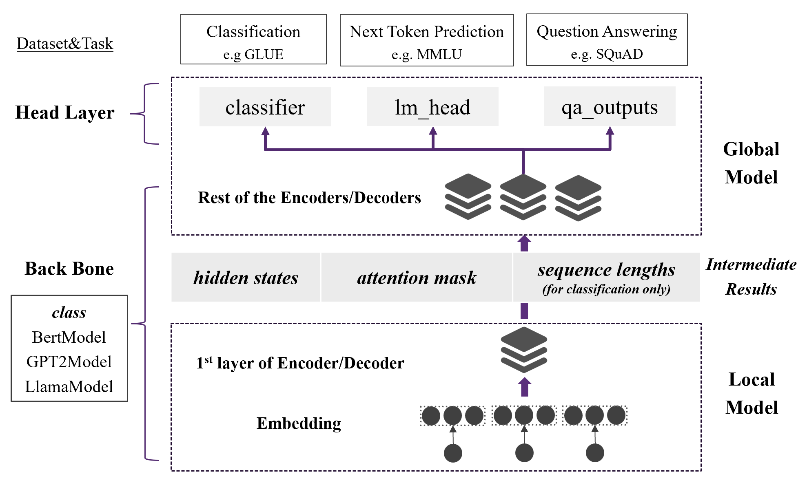
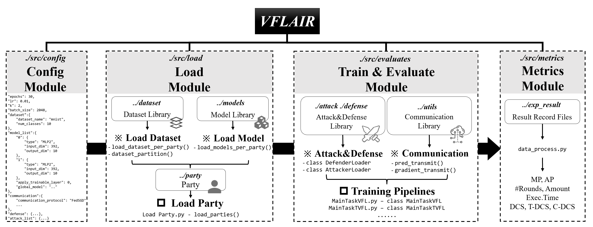

# README_LLM

[TOC]

## Introduction

In VFLAIR, we also provide a **VFL pipeline for LLM** implementation and evaluation as **a variant** of our traditional Federated Learning procedure. Here we provide the following functions: 

 

- **Model Split for LLM**: Defaultly we split the LLM between the first and second layer(encoder or decoder), which can be user-defined through config files.
  - Local Model: Embedding Layer + the first encoder
  - Global Model: the rest encoders + Head Layers for down-stream tasks
- **Three Task Pipeline**: Currently VFLAIR supported the following model&task types

| Pipeline                   | Corresponding Transformer Class | Task Type                          | Dataset |
| -------------------------- | ------------------------------- | ---------------------------------- | ------- |
| **SequenceClassification** | XXXforSequenceClassification    | Sequence Classification/Regression | GLUE    |
| **QuestionAnswering**      | XXXforQuestionAnswering         | Question Answering                 | SQuAD   |
| **Text Generation**        | XXXforCausalLM                  | Next Token Prediction              | MMLU    |

- **Three Model Base**: Bert, GPT2 and Llama based LLMs are supported in VFLAIR.

- **Finetune/Pretrained**: Currently we support the following pipelines for LLM usage
  - Inference with pretrained LLM: In this pipeline, user can load their own/third-party pretrained LLMs into the framework and do direct inference.
  - LLM finetune: In this pipeline, user can finetune their own LLM on a Bert/GPT2/Llama backbone
    - Note: Currently Fintune procedure is only supported for SequenceClassification tasks.【To be completed】

## Structure
 

- **Config Module**

  - refer to `./src/config/Readme_LLM.md` for detailed guidance about configuration file format.

- **Load Module**

  - **Load Party** - `./src/party/llm_party`

    Based on the original class 'Party', we rewrite it as Party_LLM() to cater the need of LLM finetuning&inference.

    - **Load Dataset** - `./src/dataset/party_dataset`
      - Generate input(text) into input_ids/attention_mask and token_type_ids with tokenizer
    - **Load Model** - `./src/models/llm_model`
      - In this file , we rewrite the model classes from transformer to implement model split for LLMs. Defaultly we split the model between the 1st and 2ed layer(encoder or decoder), which can be user-defined through config files.

- **Train & Evaluate Module**

  - **Training Pipelines** - `./src/evaluate/MainTaskVFL_LLM`
    - Provide Class MainTaskVFL_LLM() to finetune your own LLM or evaluate a pretrained LLM.
  - **Attack&Defense**: currently not available # TODO
  - **Communication**: currently we only provide FedSGD for VFL_LLM communication.

- **Metrics Module**: we provide the following metris for each task type

  - Classification: acc / mcc / aux
  - Regression: mse / pearson corr 
  - #TODO 


## A Quick Start

1. Download your LLM model file into `././LLM_Models/`

- Your can define your model file in the config files

2. Write your configuration file as instructed in `./src/config/Readme_LLM.md` 

3. Launch your task with:

```
python main_pipeline_llm.py --configs Your_Config_File
```


## Detailed Tutorial

### How to write a configuration file for VFL_LLM?

In VFLAIR-LLM, we provide some basic prompt generation methods. Also, user can easily implement self-defined promptin

#### Basic Parameters

```json
"epochs": 100,
"lr": 0.0005,
"k": 2,
"batch_size": 1,
```

#### Communication Protocol

> Currently only FedSGD is supported for VFLAIR-LLM

```json
"communication":{
    "communication_protocol": "FedSGD",
    "iteration_per_aggregation": 1
}
```

#### Dataset

> Currently only FedSGD is supported for VFLAIR-LLM

```json
"dataset":{
    "dataset_name": "SQuAD",
    "num_classes": 1,
    "n_shot": 1
}
```

- "dataset": the dataset for experiments
  - "dataset_name": name of the dataset
  - "num_classes": number of classes for experiments
  - "n_shot": Prompt generation method can be user-defined through this parameter. n_shot represents the number of shots needed for prompt generation
    - e.g n_shot=0[zero-shot]  n_shot=1[one-shot]

#### Model Parameters

> Currently only FedSGD is supported for VFLAIR-LLM

```json
"model_list":{
    "0": {
        "type": "rsvp-aibertserini-bert-base-squad",
        "pretrained": 1,
        "output_dim": 1,
        "model_type": "Bert",
        "max_sequence": 512,
        "path": ""
    },
    "1": {
        "type": "rsvp-aibertserini-bert-base-squad",
        "pretrained": 1,
        "output_dim": 1,
        "model_type": "Bert",
        "max_sequence": 512,
        "path": ""
    },
    "task":{
        "task_type": "QuestionAnswering",
        "metric_type": "n_best",
        "doc_stride" : 128,
        "max_seq_length": 512,
        "max_query_length" : 64,
        "max_answer_length": 30,
        "n_best_size": 20

    }
```

- "model":
  - "pretrained": define whether the task is finetuning a model or use a pretrained model for inference.
  - "max_sequence": max length of input acceptable for the model.
    - normally we set 512 for Bert / 1024 for GPT2
- "task": Definition of task type
  - "task_type": name of the task type(QuestionAnswering/SequenceClassification...)
  - "metric_type"/"n_best_size": specific for QuestionAnswering tasks. it represents the type of metric calculation for QA(text-span) tasks
  - “doc_stride”/“max_seq_length”...: specific for QuestionAnswering tasks. it defines the max length of QA input


### How to import New LLM models?

All models on huggingface can be directly loaded into VFLAIR as we support the same `.from_pretain(YOUR_MODEL)` API in the framework.

Note that you should identify the type of model pretrained (e.g. CausalLM...) in configuration file first. Models that can be imported with the following API can be used in VFLAIR:

- AutoModel.from_pretrained()
- AutoModelorCausalLM.from_pretrained()
- AutoModelorSequenceClassification.from_pretrained()
- AutoModelforQuestionAnswering.from_pretrained()

1. Download your model in to `../Your_Model_Path/Your_Model_Name`
2. Add your model path and name pair into `.src/load/Load_Model.py`
3. Write a proper configuration file according to tutorial
4. Launch your task with:

```
python main_pipeline_llm.py --configs Your_Config_File
```


## Other Details

### Prompt Generation

In VFLAIR-LLM, we provide some basic prompt generation methods. Also, user can easily implement self-defined prompting techniques based on our tutorials.

- **Zero-shot& Few-shots**: Number of  shots used can be alter through the config parameter *n-shot* in configuration files .
- **User-defined Prompting Method**: In `./src/load/Load_Dataset.py`, we provide function `load_dataset_per_party_llm()` for dataset loading and promp generation. Users can easily alter the prompting method here.