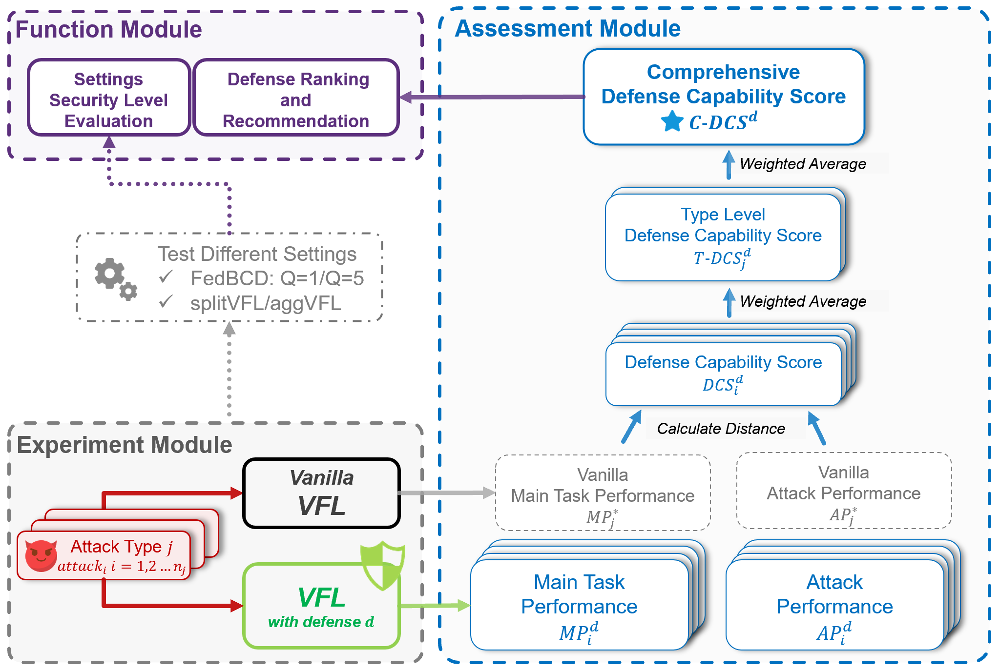

# Metrics & Benchmark

## Metrics

To fairly evaluate attacks and defenses in a VFL system, we identify two crucial metrics: Attack
Performance (AP) and Main Task Performance (MP)：

- **Attack Performance (AP)**： The success rate of a given attack, which also reflects the vulnerability of a VFL system to the given attack. The definition of AP varies with respect to the type of the attack and is summarized in Tab. 1
- **Main Task Performance (MP)** ：The final model prediction accuracy on the test dataset. MP is an important metric to evaluate defenses because a good defense should preserve the performance of the main task of VFL as much as possible.
- **Defense Capability Score (DCS)**： Based on AP and MP, we further develop Defense Capability Score (DCS) to provide straightforward comparisons of all defenses considering a single attack. Let $df = (AP, MP)$ represents the performance of a defense on a AP-MP graph, then we define its defense capability score (DCS) based on the distance between $df$ to an ideal defense $df ∗ = (AP∗, MP∗)$.

   $\text{DCS} = \frac{1}{1+D(df,df^{*})} = \frac{1}{1+\sqrt{(1-\beta)(\text{AP}-\text{AP}^{*})^2+\beta(\text{MP}-\text{MP}^{*})^2}}$

- **Type-level Defense Capability Score (T-DCS)**: the DCS score averaged by attack type. 
  Treating all $I_j$ attacks of the same attack type $j$ as equally important, we average DCS for each attack $i$ to get T-DCS for attack type $j\in \mathcal{A}$:

   $\text{T-DCS}_j = \frac{1}{I_j} \sum_{i=1}^{I_j} \text{DCS}_i$

- **Comprehensive Defense Capability Score (C-DCS)** ： a comprehensive assessment of the capability of a defense strategy with respect to all kinds of attacks and is a weighted average of T-DCS (depending on types of attacks you're testing).
  
  $\text{C-DCS} = \sum_{j\in \mathcal{A}} w_j \text{T-DCS}_j, \,\, \text{with} \sum_{j \in \mathcal{A}} w_j = 1.0 $

## Benchmark Procedure

 

## How to do your own benchmark

1. Select the attacks you are going to evaluate.
2. Choose a target defense $A$, test $AP$ and &MP$ under the defense and a w/o defense settings, and align the results as in  `/src/metrics/test_data_by_attack.md`
3. Change configuration settings in `/src/metrics/data_process.ipynb` according to your need, and launch the file to form a full benchmark report.
